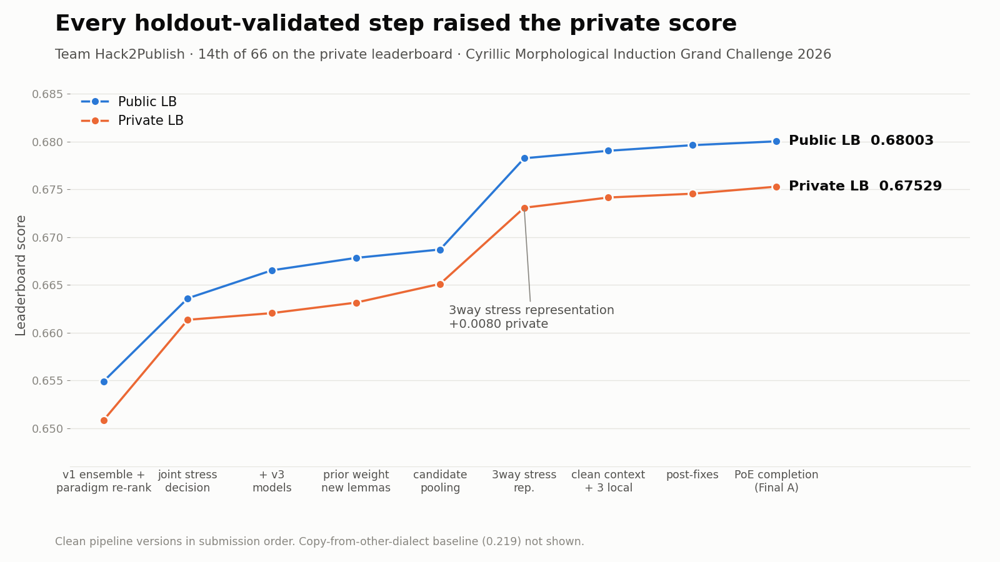
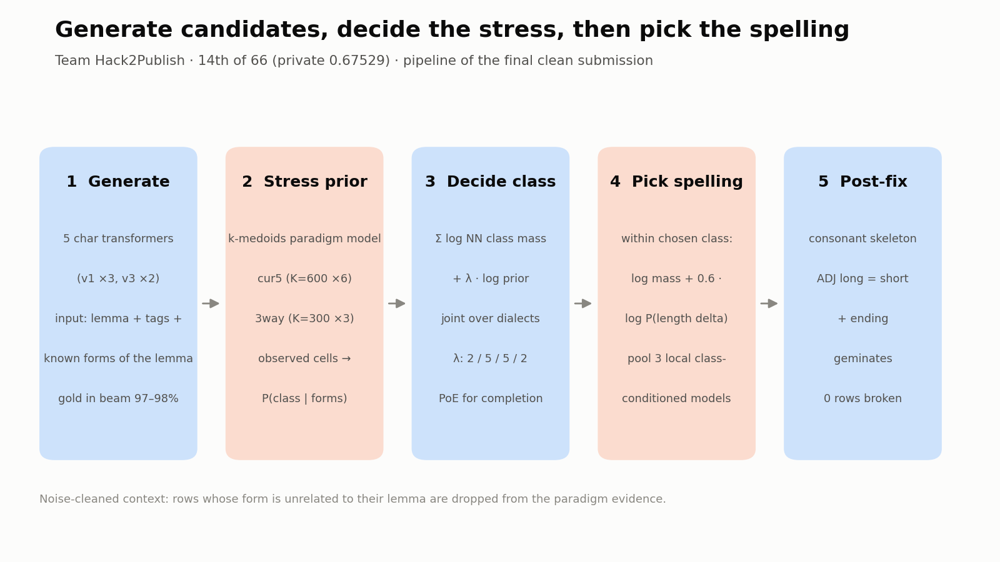
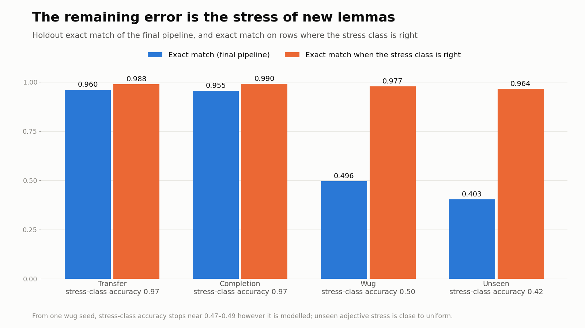
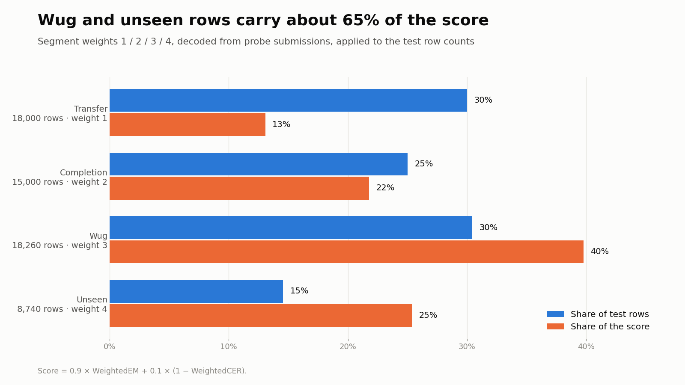

# Cyrillic Morphological Induction Grand Challenge 2026

Character-level morphological generation for a synthetic Cyrillic language, combining context-aware Transformers with explicit stress-paradigm inference.

[Competition](https://www.kaggle.com/competitions/cyrillic-morphological-induction-grand-challenge) · [Solution writeup](SOLUTION_WRITEUP.md)

## Results

**Final position: 14th of 66 teams on the private leaderboard** (team Hack2Publish).

| Final submission (both clean) | Private | Public |
|---|---:|---:|
| `runs/final/var_complete_poe.csv` | **0.67529** | 0.68003 |
| `runs/final/sub_final_v4.csv` | 0.67500 | 0.67968 |

The public leaderboard lists the team 13th with 0.68648. That figure comes from a leak-based submission made before the host's ruling, and it was not selected as a final. See the [writeup](SOLUTION_WRITEUP.md) for details.

## Figures









The figures are generated by `runs/final/make_writeup_chart.py`, `make_writeup_gallery.py` and `make_writeup_thumbnail.py`.

## Approach

1. Generate beam candidates using five character-level Transformer models conditioned on the lemma, grammatical tags, dialect, lexical features, and known forms of the same lemma.
2. Infer stress using explicit paradigm priors: **cur5** for initial/end-relative stress and **3way** for stress relative to the stem boundary.
3. Select the stress class with regime-specific neural/prior weights. Completion uses complementary cur5 and 3way priors; unseen lemmas use per-row decisions.
4. Select spelling within the class using candidate mass and a length-delta prior. Pool class-conditioned local models and apply targeted morphological fixes.

The main remaining difficulty is stress selection for new lemmas. High gold coverage in the beam does not mean the correct candidate can always be identified from the available evidence.

## Data and evaluation

Place the competition files in `data/` after accepting the competition rules and downloading them from Kaggle.

| File | Rows | Purpose |
|---|---:|---|
| `train.csv` | 300,000 | Labeled training examples |
| `dev.csv` | 20,000 | Labeled development examples |
| `wug_seeds.csv` | 4,800 | Seed forms for new lemmas |
| `test_features.csv` | 60,000 | Inputs requiring predictions |
| `sample_submission.csv` | 60,000 | Required submission schema and ID order |

Predict `form_vvz` from `lemma_ru`, `pos`, `feats`, `dialect`, `lemma_frequency`, and `yat_flag`. The output must preserve Cyrillic spelling and the combining acute accent used for stress.

The evaluation formula is:

```text
Score = 0.9 × Weighted Exact Match + 0.1 × (1 − Weighted CER)
```

Local validation separates dialect transfer, paradigm completion, wug, and completely unseen lemmas. It uses inferred segment weights of 1/2/3/4 and the test segment mixture. The historical seed-123 holdout was reused during development, so it is not an independent final lockbox.

## Repository layout

| Path | Contents |
|---|---|
| [SOLUTION_WRITEUP.md](SOLUTION_WRITEUP.md) | Method, experiments, results, and limitations |
| [kaggle/train_kaggle.py](kaggle/train_kaggle.py) | Standalone character Transformer training and beam generation |
| [src/data.py](src/data.py) | Character vocabulary, input encoding, and context sampling |
| [src/model.py](src/model.py) | Local sequence-to-sequence model |
| [src/paradigm.py](src/paradigm.py) | Explicit stress-paradigm model |
| [src/local_train.py](src/local_train.py) | Class-conditioned local-model training |
| [src/final.py](src/final.py) | Candidate selection, pooling, and post-processing |
| [src/validate.py](src/validate.py) | Historical validation splits and weighted metric |
| [src/preflight.py](src/preflight.py) | Submission schema and prediction checks |
| `src/exp/` | Research and diagnostic experiments |
| `runs/` | Experiment outputs, candidate pools, and submissions |

Competition data, checkpoints, and candidate dumps are excluded from version control. A fresh clone alone is insufficient to reproduce the final ensemble.

## Setup

Use a Python environment with NumPy, pandas, PyTorch, and RapidFuzz:

```bash
python3 -m venv .venv
source .venv/bin/activate
python3 -m pip install numpy pandas torch rapidfuzz
```

CUDA is supported by the standalone Kaggle training script. Local models support Apple MPS or CPU; CPU training and beam decoding can be slow. The repository does not currently provide a pinned dependency lockfile.

## Running the clean pipeline

Run commands from the repository root. The following training example creates one development generator; it does not reproduce the five-model final ensemble:

```bash
MODE=dev SEEDS=0 python3 kaggle/train_kaggle.py
```

Final inference requires the assembled `runs/test_cands_v1v3.pkl` candidate pool, the local checkpoints and metadata, and the clean context flags at `runs/exp/noise/sub_flags_traindev.csv`. Historical validation instead requires `runs/kdev2/val_cands_aligned.pkl` and holdout-safe local models.

With those artifacts available, the strongest recorded clean configuration can be rebuilt as follows:

```bash
CFG='{"transfer":{"rep":"cur5","lam":2.0,"joint":true},"complete":{"rep":"poe","lam":5.0,"joint":true,"lam5":1.0},"wug":{"rep":"3way","lam":5.0,"joint":true},"unseen":{"rep":"cur5","lam":2.0,"joint":false}}'

python3 src/final.py \
  --mode full --ctx_clean 1 --fixes BAC --cfg "$CFG" \
  --models runs/loc_full,runs/loc_full_s1,runs/loc_full_s3 \
  --w_loc 0.5 --device mps --cache_tag _readme_clean_v1 \
  --out runs/sub_clean.csv

python3 src/preflight.py runs/sub_clean.csv runs/final/var_complete_poe.csv
```

Use `--device cpu` when MPS is unavailable. Use a new cache tag for each clean rebuild; the tag creates a separate cache under `runs/final/`. The preflight reference CSV must also be available locally. These commands generate and check a file; they do not submit it to Kaggle.

## Clean artifact policy

The host prohibited deliberate exploitation of copied labeled forms to recover hidden test information. Follow the exclusions in [QUARANTINE_HOST_RULING.md](runs/final/QUARANTINE_HOST_RULING.md).

Leak-derived submissions, observations, caches, and tuning evidence are excluded from the clean solution. Do not enable `--leak`, `--leak_lem`, `--leak_stem`, or `--obs_cfg`, or activate leak context. Do not reuse overwritten untagged caches or quarantined caches. Historical automation scripts may submit automatically; use the explicit local commands above for reproduction.

## License

The project code and documentation are available under the [MIT License](LICENSE). Competition data and third-party materials remain subject to their own terms.
